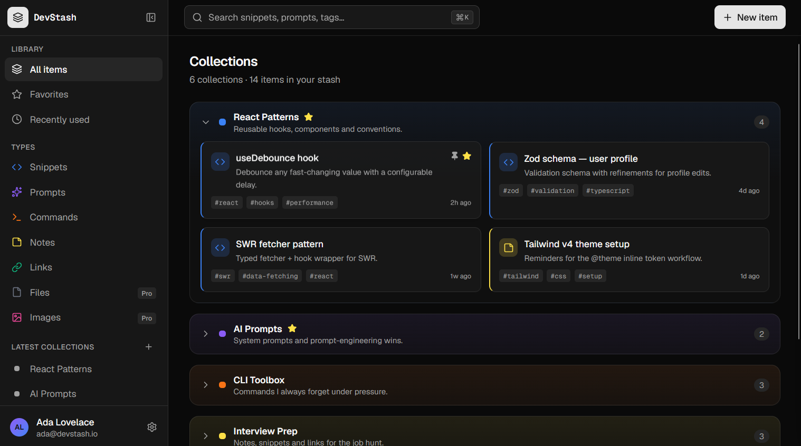
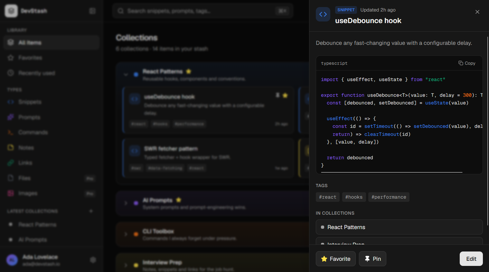

<div align="center">

# DevStash

**Un hub rapide, recherchable et augmenté par l'IA pour vos snippets, prompts, commandes, notes, fichiers, images et liens.**

[](https://github.com/dan0203/devstash/actions/workflows/ci.yml)
[](./LICENSE)


🇬🇧 [English](./README.md)&nbsp;&nbsp;·&nbsp;&nbsp;🇫🇷 Français

**[Essayer la démo en ligne →](https://devstash-zeta-rust.vercel.app)**

</div>

---

## Démo en ligne

L'application déployée a un bouton **« Try the Live Demo »** sur la page d'accueil qui connecte instantanément à un compte invité public — aucune inscription, aucun identifiant à saisir.

Quelques choix volontaires derrière ce bouton :

- **Les identifiants ne transitent jamais côté navigateur.** Le bouton appelle une server action qui se connecte avec des identifiants lus côté serveur depuis les variables d'environnement, pas un formulaire pré-rempli avec un mot de passe visible.
- **Le compte de démo est volontairement en offre gratuite**, pas Pro, pour que les limites du plan (50 items / 3 collections, upload de fichiers/images restreint) restent réellement visibles plutôt que masquées par un compte débloqué.
- **Passer "vraiment" en Pro est sans risque à essayer.** Le paiement du compte démo passe par une configuration Stripe **en mode test** dédiée (ses propres clés, prix et secret de webhook), donc un visiteur peut suivre une vraie page de paiement avec une carte de test et voir le compte basculer en Pro — sans aucun risque de facturation réelle.
- **Une tâche planifiée quotidienne réinitialise le compte.** Un Cron Vercel (`vercel.json` → `GET /api/cron/reset-demo`) efface chaque jour les items/collections du compte invité et remet à zéro tout état de facturation de test, pour que les modifications des visiteurs ou les paiements de test ne s'accumulent jamais ni ne laissent le compte bloqué en "Pro". L'endpoint vérifie un secret (`CRON_SECRET`) avant toute action et refuse par défaut (`401`) s'il est absent ou incorrect.

L'inscription de nouveaux comptes est fermée sur cette instance (voir [Sécurité](#sécurité) ci-dessous) — c'est un projet de portfolio/démo solo, pas un produit multi-utilisateurs ouvert, donc le compte invité ci-dessus est la façon prévue de l'essayer.

## Captures d'écran

<p align="center">
  
  
</p>

## À propos de ce projet

DevStash est parti du cours *Coding With AI* de Brad Traversy, comme exercice pour pratiquer un **workflow de développement assisté par IA structuré et revu humainement**, plutôt qu'une approche "prompt et on verra". Concrètement, chaque fonctionnalité suit le même cycle, appuyé sur des fichiers versionnés plutôt que sur un historique de conversation éphémère :

1. **Spec** — la fonctionnalité est décrite dans `context/current-feature.md` (objectifs, contraintes, notes) avant qu'une seule ligne de code ne soit touchée.
2. **Build** — l'implémentation se fait sur sa propre branche, par petites étapes révisables.
3. **Prove** — `npm run build`, `npm run lint` et la suite Vitest concernée doivent tous passer ; les parcours non triviaux sont aussi vérifiés manuellement (souvent via Playwright) sur un serveur de développement avant fusion.
4. **Land** — la fonctionnalité est fusionnée, sa branche supprimée, et une entrée datée est ajoutée à la section Historique de `context/current-feature.md` — un journal lisible d'environ 280 commits de décisions, d'impasses et de corrections.

Le dossier `.claude/` documente cette démarche plus en détail : `.claude/skills/feature/` implémente ce workflow comme une commande réutilisable, et `.claude/agents/` définit quatre sous-agents de revue dédiés (`auth-auditor`, `code-scanner`, `refactor-scanner`, `ui-reviewer`) utilisés pour auditer le code indépendamment de l'étape d'implémentation — `docs/audit-results/AUTH_SECURITY_REVIEW.md` est un vrai résultat produit par l'agent `auth-auditor`, pas un texte marketing écrit à la main.

Ce choix est assumé plutôt que caché : l'intérêt n'est pas qu'une IA ait écrit le code, mais la capacité à **diriger et réviser un développement assisté par IA avec la même rigueur que n'importe quel autre travail d'ingénierie** — des spécifications avant le code, des tests avant la fusion, et une trace d'audit écrite plutôt qu'une simple promesse sur parole.

## Fonctionnalités

- **Items et types d'items** — snippets, prompts, notes, commandes, liens (offre gratuite) et fichiers/images (Pro), chacun avec un rendu adapté à son type (éditeur de code basé sur Monaco pour les snippets, éditeur markdown pour les types texte, etc.)
- **Collections** — regroupements définis par l'utilisateur, many-to-many, mélangeant librement les types d'items
- **Recherche unifiée** — sur les titres, le contenu, les tags et les types, plus une palette de commandes (⌘K)
- **Favoris et épinglage**, une vue des éléments récemment utilisés
- **Authentification** — email/mot de passe (bcrypt, vérification d'email, réinitialisation de mot de passe) et OAuth GitHub, via NextAuth v5
- **Fonctionnalités IA (Pro)** — suggestions de tags automatiques, résumés d'items, "expliquer ce code", et un optimiseur de prompts, le tout propulsé par Mistral avec des réponses contraintes par schéma JSON strict
- **Facturation** — abonnements Stripe (mensuel/annuel), portail client, et synchronisation du plan pilotée par webhook
- **Limites de plan freemium** — appliquées en production (50 items / 3 collections sur l'offre gratuite ; upload de fichiers/images et fonctionnalités IA réservés au Pro)
- **Mode sombre** par défaut

## Stack technique

| Couche | Choix |
| --- | --- |
| Framework | Next.js 16 (App Router, TypeScript, Turbopack) |
| Base de données | Neon (Postgres serverless) + Prisma 7 |
| Authentification | NextAuth v5 — identifiants (bcrypt) + OAuth GitHub |
| Stockage de fichiers | Cloudflare R2 (compatible S3) |
| Paiements | Stripe (abonnements + webhooks) |
| IA | Mistral AI, réponses contraintes par schéma JSON strict |
| Email transactionnel | Resend |
| Limitation de débit | Upstash Redis (fenêtre glissante) |
| Tests | Vitest — 139 tests répartis sur 16 fichiers (server actions et utilitaires) |
| Lint / format | ESLint (config plate) + Prettier |
| CI | GitHub Actions — lint, tests, build à chaque push/PR |
| Hébergement | Vercel (application + tâche Cron quotidienne) |

## Sécurité

DevStash utilise Prisma + Postgres plutôt qu'un service avec sécurité au niveau ligne intégrée (Supabase, Firebase) — l'isolation des données est donc entièrement assurée par le code applicatif plutôt que déclarée comme une politique de base de données :

- **Chaque requête sur un item/une collection est scopée par `userId`** au niveau même de la requête Prisma — lecture, écriture, suppression, et même le téléchargement de fichiers (qui revérifie la session et la propriété avant d'aller chercher l'objet sur R2) suivent tous ce même schéma. Aucun utilisateur ne peut atteindre les données d'un autre en devinant un identifiant.
- **La limitation de débit s'exécute avant tout accès base de données ou calcul de mot de passe.** Le limiteur de connexion est vérifié dans `authorize()` avant la recherche de l'utilisateur ou l'appel à `bcrypt.compare()`, donc une requête limitée ne fuite jamais de signal de timing ou d'existence de compte.
- **Les mots de passe sont hachés en bcrypt à 12 rounds** ; les tokens de vérification d'email et de réinitialisation de mot de passe sont de 256 bits, à usage unique, et expirent au bout de 24h ; un changement de mot de passe invalide les sessions JWT existantes sur les autres appareils.
- **L'inscription de nouveaux comptes est fermée par défaut** (`REGISTRATION_ENABLED=false`), et — indépendamment de ce flag — le callback OAuth GitHub ne connecte que des comptes **déjà existants**, il ne peut donc jamais créer silencieusement un nouvel utilisateur. Pour laisser entrer quelqu'un de nouveau via GitHub sans ouvrir l'inscription publique, il suffit de créer une ligne `User` pour son adresse email directement (via le script de seed ou une écriture ponctuelle en base) ; pour rouvrir l'inscription libre en entier, passer `REGISTRATION_ENABLED=true`.
- **Le compte de démo public est entièrement isolé** : sa propre configuration Stripe en mode test (pour qu'un visiteur ne puisse ni déclencher une vraie facturation ni laisser le compte partagé bloqué en "Pro"), et une réinitialisation quotidienne par tâche planifiée (protégée par `CRON_SECRET`, refuse par défaut) pour que l'activité des visiteurs ne s'accumule jamais.
- **Un audit interne dédié existe** : `docs/audit-results/AUTH_SECURITY_REVIEW.md`, produit par un sous-agent de revue conçu spécifiquement pour ça (`.claude/agents/auth-auditor.md`), scopé exactement aux points d'authentification que NextAuth ne gère pas automatiquement (limitation de débit, hachage des mots de passe, sécurité des tokens, énumération de comptes). Son seul point ouvert (sévérité basse) — faire confiance au header `X-Forwarded-For` pour la limitation par IP — est un compromis documenté et accepté, spécifique au déploiement derrière Vercel, qui réécrit ce header avant qu'il n'atteigne l'application.
- **Cohérence "ne jamais planter à l'import" pour les clients tiers.** `stripe.ts`, `mistral.ts` et `r2.ts` sont chacun écrits pour que leur import ne lève jamais d'exception juste parce qu'une clé API est absente (une valeur factice de repli est utilisée à la place) — c'est important car Next.js collecte les données de page au moment du build en important chaque route, donc une clé manquante ailleurs ne devrait pas pouvoir casser le build de production. `resend.ts` avait été oublié dans ce pattern lors d'une session de travail précédente et levait *bien* une exception à l'import sans clé configurée, cassant un vrai build de production ; il suit désormais la même convention que les autres.

### Fiabilité de l'envoi d'emails (Resend)

Quelques détails opérationnels concrets, qui valent la peine d'être documentés plutôt que cachés :

- Les emails transactionnels sont envoyés depuis `no-reply@devstash.danzerbib.me`, un **sous-domaine dédié** (vérifié via DKIM/SPF) plutôt que le domaine racine — ce qui isole la réputation d'envoi et évite tout conflit avec d'éventuels enregistrements DNS déjà présents sur le domaine racine.
- `RESEND_API_KEY` doit être une **clé "Sending access" restreinte à ce seul domaine**, pas une clé à accès complet.
- Un piège rencontré en pratique : modifier les permissions/le domaine d'une clé existante dans le dashboard Resend semble invalider silencieusement l'ancien secret. Un `401 API key is invalid` juste après un changement de scope signifie qu'il faut régénérer une nouvelle clé plutôt que de réutiliser l'ancienne valeur.
- `EMAIL_VERIFICATION_ENABLED` permet de désactiver entièrement la vérification pour un environnement sans domaine d'envoi vérifié (les nouveaux utilisateurs sont alors auto-vérifiés).
- Le DMARC (enregistrement TXT `_dmarc.devstash`, `p=none` pour commencer) n'a pas encore été ajouté — une prochaine étape raisonnable pour une hygiène de délivrabilité complète.
- La réception d'emails est volontairement désactivée (pas d'enregistrement MX sur le sous-domaine) — rien dans l'application ne traite les emails entrants, il n'y a donc aucune raison d'en accepter.

## Démarrage

**Prérequis :** Node 20+, une base Postgres (un projet [Neon](https://neon.tech) gratuit convient très bien).

```bash
git clone https://github.com/dan0203/devstash.git
cd devstash
cp .env.example .env   # renseigner au moins DATABASE_URL et AUTH_SECRET — voir plus bas
npm install             # exécute aussi `prisma generate`
npm run db:seed         # optionnel : seed les types d'items système + un jeu de données de démo
npm run dev
```

Ouvrir [http://localhost:3000](http://localhost:3000).

### Variables d'environnement

Voir [`.env.example`](./.env.example) pour la liste complète — chaque variable est documentée en ligne avec son rôle et ce qui se passe si elle est absente. Au minimum, `DATABASE_URL` et `AUTH_SECRET` sont nécessaires pour démarrer ; tout le reste (OAuth GitHub, Resend, Upstash, R2, Stripe, Mistral, le compte de démo, le secret de cron) se dégrade proprement si absent plutôt que de planter, donc une instance locale utile tourne avec juste une base de données.

### Tests

```bash
npm test          # Vitest, une seule fois — 139 tests répartis sur 16 fichiers
npm run test:watch
```

Les tests couvrent les server actions et les utilitaires purs (`src/actions/**`, `src/lib/**` hors `src/lib/db/**`), tous avec des dépendances mockées — aucune vraie base de données ni service externe n'est sollicité. Les composants ne sont pas testés unitairement ; les parcours d'interface non triviaux sont plutôt vérifiés manuellement sur un serveur de développement dans le cadre du workflow de chaque fonctionnalité (voir [À propos de ce projet](#à-propos-de-ce-projet)).

### CI

Chaque push et pull request vers `main` lance le lint, la suite de tests complète et un build de production via GitHub Actions ([`.github/workflows/ci.yml`](./.github/workflows/ci.yml)).

## Limitations connues

- **Les types d'items personnalisés** (au-delà des sept types système intégrés) sont prévus dans la conception mais pas encore implémentés.
- **L'application des limites de plan** repose sur un seul flag global (`ENFORCE_PLAN_LIMITS`) plutôt que des dérogations par utilisateur — suffisant pour un modèle freemium à deux offres, à revoir pour quelque chose de plus granulaire.
- **Le choix du modèle IA a été contraint par de vraies limites de compte, pas seulement par les capacités du modèle** : `mistral-large-latest` n'est pas disponible sur l'offre du compte utilisé, et `mistral-small-latest` a subi des limitations de débit soutenues en usage normal — les fonctionnalités IA tournent donc sur `ministral-14b-latest`, avec un gestionnaire dédié pour les erreurs 429 et un message utilisateur clair ("réessayer dans un instant") plutôt qu'une erreur générique.
- **Le DMARC n'est pas encore configuré** pour le sous-domaine d'envoi (voir [Fiabilité de l'envoi d'emails](#fiabilité-de-lenvoi-demails-resend) ci-dessus).

## Licence

MIT — voir [LICENSE](./LICENSE).
