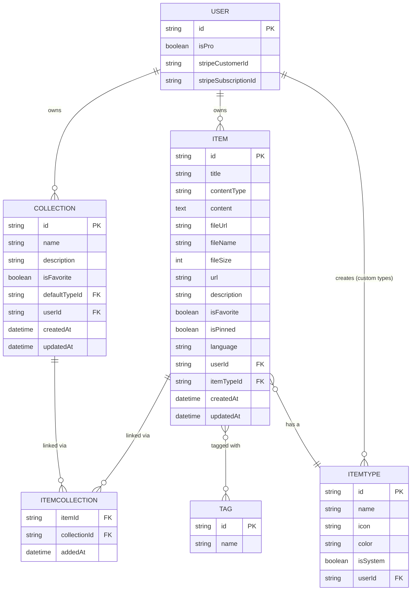
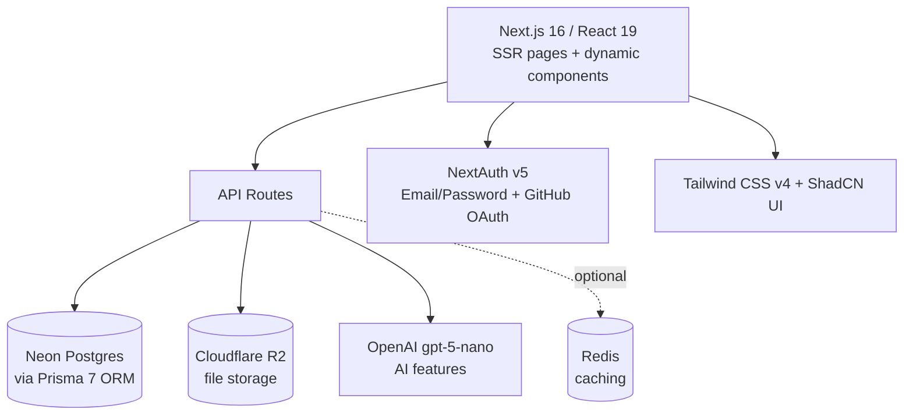
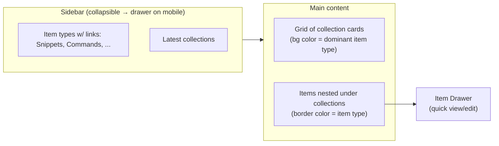

# DevStash — Project Overview

> A fast, searchable, AI-enhanced hub for all your dev knowledge & resources.

---

## 1. Problem

Developers scatter their working knowledge across too many tools:

| Scattered today | Should live in DevStash |
|---|---|
| Code snippets | VS Code, Notion |
| AI prompts | Chat history |
| Context files | Buried in projects |
| Useful links | Browser bookmarks |
| Docs | Random folders |
| Commands | `.txt` files |
| Project templates | GitHub Gists |
| Terminal history | Shell history |

The result: constant context-switching, lost knowledge, and inconsistent workflows. **DevStash consolidates all of it into one fast, searchable, AI-enhanced hub.**

---

## 2. Target Users

| Persona | Core need |
|---|---|
| 🧑‍💻 **Everyday Developer** | Fast capture/retrieval of snippets, prompts, commands, links |
| 🤖 **AI-first Developer** | Save & organize prompts, contexts, system messages, workflows |
| 🎓 **Content Creator / Educator** | Store code blocks, explanations, course notes |
| 🏗️ **Full-stack Builder** | Collect patterns, boilerplates, API examples |

---

## 3. Core Features

### A. Items & Item Types

Items are the atomic unit of DevStash. Every item has a **type**, which determines how its content is stored and rendered.

**System types** (built-in, cannot be edited or deleted by users):

| Type | Content kind | Tier |
|---|---|---|
| `snippet` | text (code) | Free |
| `prompt` | text | Free |
| `note` | text | Free |
| `command` | text | Free |
| `link` | url | Free |
| `file` | file upload | Pro |
| `image` | file upload | Pro |

- Users can later define **custom types** (Pro, post-MVP).
- Every type resolves to one of three content kinds: `text`, `url`, or `file`.
- Items are created and viewed via a **quick-access drawer** — no full-page navigation required.
- Route convention: `/items/[type]` (e.g. `/items/snippets`, `/items/prompts`).

### B. Collections

- A user-defined grouping of items, of **any mixed type**.
- Items can belong to **multiple collections** (many-to-many) — e.g. a React snippet can live in both "React Patterns" and "Interview Prep".
- Examples: *React Patterns* (snippets, notes), *Context Files* (files), *Python Snippets* (snippets).

### C. Search

Unified search across:
- Content
- Tags
- Titles
- Types

*(MVP: basic query search. Pro: expanded/advanced search — see Monetization.)*

### D. Authentication

- Email/password
- GitHub OAuth
- Powered by **NextAuth v5**

### E. Other Features

- ⭐ Favorite items & collections
- 📌 Pin items to top
- 🕓 Recently used view
- 📥 Import code from a file
- 📝 Markdown editor for text-based types
- 📎 File upload for `file` / `image` types
- 📤 Export data (multiple formats)
- 🌙 Dark mode (default)
- 🔀 Add/remove an item across multiple collections
- 🔗 View which collections an item belongs to

### F. AI Features (Pro only)

- 🏷️ AI auto-tag suggestions
- 📄 AI summaries
- 💡 AI "Explain this code"
- ✨ AI prompt optimizer

---

## 4. Data Model

### 4.1 Entity Relationship Diagram



### 4.2 Prisma Schema (draft)

> ⚠️ Rough draft — not final. Field types/relations to be validated against latest **Prisma 7** docs before implementation.
> **Rule: never use `db push` or edit the DB directly. All schema changes go through migrations, run in dev then prod.**

```prisma
// ── User (extends NextAuth) ────────────────────────────
model User {
  id                   String   @id @default(cuid())
  // ...NextAuth-required fields (name, email, image, accounts, sessions)

  isPro                Boolean  @default(false)
  stripeCustomerId     String?  @unique
  stripeSubscriptionId String?  @unique

  items       Item[]
  collections Collection[]
  itemTypes   ItemType[]

  createdAt DateTime @default(now())
  updatedAt DateTime @updatedAt
}

// ── Item Type ───────────────────────────────────────────
model ItemType {
  id       String  @id @default(cuid())
  name     String
  icon     String
  color    String
  isSystem Boolean @default(false)

  userId String? // null for system types
  user   User?   @relation(fields: [userId], references: [id], onDelete: Cascade)

  items Item[]

  @@unique([userId, name])
}

// ── Item ────────────────────────────────────────────────
model Item {
  id          String  @id @default(cuid())
  title       String
  contentType String // "text" | "file"
  content     String? @db.Text // text content, null if file
  fileUrl     String? // R2 URL, null if text
  fileName    String?
  fileSize    Int?
  url         String? // for link type
  description String?
  isFavorite  Boolean @default(false)
  isPinned    Boolean @default(false)
  language    String? // optional, for code snippets

  userId String
  user   User   @relation(fields: [userId], references: [id], onDelete: Cascade)

  itemTypeId String
  itemType   ItemType @relation(fields: [itemTypeId], references: [id])

  tags        Tag[]
  collections ItemCollection[]

  createdAt DateTime @default(now())
  updatedAt DateTime @updatedAt

  @@index([userId])
  @@index([itemTypeId])
}

// ── Collection ──────────────────────────────────────────
model Collection {
  id          String  @id @default(cuid())
  name        String
  description String?
  isFavorite  Boolean @default(false)

  defaultTypeId String?
  defaultType    ItemType? @relation(fields: [defaultTypeId], references: [id])

  userId String
  user   User   @relation(fields: [userId], references: [id], onDelete: Cascade)

  items ItemCollection[]

  createdAt DateTime @default(now())
  updatedAt DateTime @updatedAt

  @@index([userId])
}

// ── Item ↔ Collection join table ───────────────────────
model ItemCollection {
  itemId       String
  item         Item       @relation(fields: [itemId], references: [id], onDelete: Cascade)
  collectionId String
  collection   Collection @relation(fields: [collectionId], references: [id], onDelete: Cascade)

  addedAt DateTime @default(now())

  @@id([itemId, collectionId])
}

// ── Tag ─────────────────────────────────────────────────
model Tag {
  id    String @id @default(cuid())
  name  String @unique
  items Item[]
}
```

**Open questions to resolve before migration:**
- Does `ItemType.color` need to fall back to a default when a custom type doesn't set one?
- Should `Tag` be scoped per-user (`@@unique([userId, name])`) rather than global? As written, `name @unique` means tags are shared across all users — likely a bug to fix.
- `Collection.defaultTypeId` needs a defined relation name if Prisma auto-naming collides with `Item.itemTypeId`.

---

## 5. Tech Stack



| Layer | Choice | Notes |
|---|---|---|
| Framework | Next.js 16 / React 19 | SSR pages, dynamic components |
| Backend | Next.js API routes | Items, file uploads, AI calls — one repo, less overhead |
| Language | TypeScript | Type safety throughout |
| Database | Neon (Postgres) | Cloud-hosted |
| ORM | Prisma 7 (latest) | **Migrations only — never `db push` in dev or prod** |
| Caching | Redis | Maybe / TBD |
| File storage | Cloudflare R2 | For `file` / `image` uploads |
| Auth | NextAuth v5 | Email/password + GitHub OAuth |
| AI | OpenAI `gpt-5-nano` | Auto-tag, summarize, explain, optimize prompts |
| Styling | Tailwind CSS v4 + ShadCN UI | — |

---

## 6. Monetization — Freemium

| | **Free** | **Pro — $8/mo or $72/yr** |
|---|---|---|
| Items | 50 total | Unlimited |
| Collections | 3 | Unlimited |
| System types | All except file/image | All, incl. file/image |
| Custom types | ❌ | ✅ (coming later) |
| Search | Basic | Basic (advanced TBD) |
| File / image uploads | ❌ | ✅ |
| AI auto-tagging | ❌ | ✅ |
| AI code explanation | ❌ | ✅ |
| AI prompt optimizer | ❌ | ✅ |
| Data export | ❌ | ✅ (JSON/ZIP) |
| Support | Standard | Priority |

> **Dev-mode note:** Build the Pro/Free gating foundation now (`isPro`, Stripe fields), but leave all features unlocked for all users during development.

---

## 7. UI / UX

### Design direction
- Modern, minimal, developer-focused
- Dark mode by default; light mode optional
- Clean typography, generous whitespace, subtle borders/shadows
- Reference points: **Notion, Linear, Raycast**
- Syntax highlighting for code blocks

### Layout



- **Desktop-first**, mobile usable; sidebar collapses to a drawer on small screens.
- Individual items open in a **quick-access drawer** rather than a new page.

### Type Colors & Icons

| Type | Color | Hex | Icon (lucide) |
|---|---|---|---|
| Snippet | 🔵 Blue | `#3b82f6` | `Code` |
| Prompt | 🟣 Purple | `#8b5cf6` | `Sparkles` |
| Command | 🟠 Orange | `#f97316` | `Terminal` |
| Note | 🟡 Yellow | `#fde047` | `StickyNote` |
| File | ⚪ Gray | `#6b7280` | `File` |
| Image | 🌸 Pink | `#ec4899` | `Image` |
| Link | 🟢 Emerald | `#10b981` | `Link` |

### Micro-interactions
- Smooth transitions
- Hover states on cards
- Toast notifications for actions
- Loading skeletons

---

## 8. Open Items / Follow-ups

- [ ] Resolve `Tag` scoping (per-user vs. global) in the Prisma schema
- [ ] Confirm Prisma 7 migration workflow against latest docs
- [ ] Decide if Redis caching is in scope for MVP
- [ ] Define "advanced search" for Pro tier (currently unspecified)
- [ ] Spec out custom item types (post-MVP feature)
- [ ] Define export formats in detail (JSON/ZIP confirmed — anything else?)
